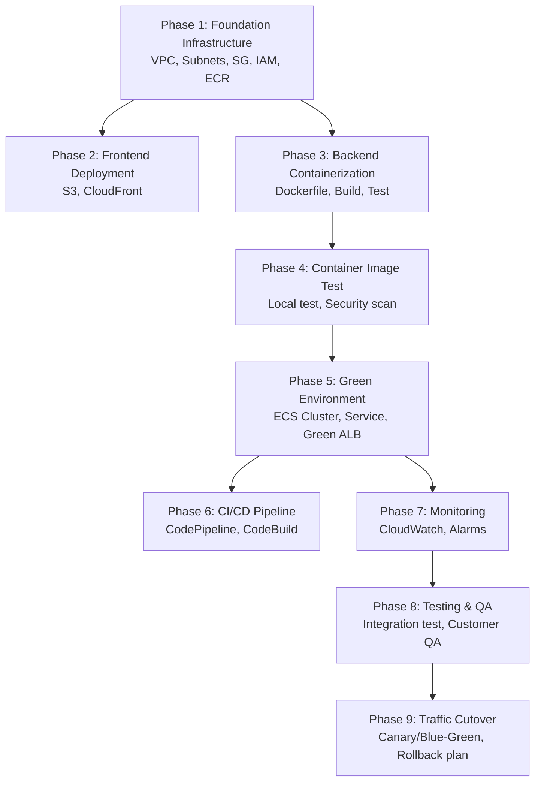

# Architecture Design Stage Guide

## Purpose
Guide AI through designing the To-Be architecture based on As-Is analysis and requirements, with best practice compliance and customer approval.

---

## Objectives
- Design target architecture with architecture diagram
- Apply AWS best practices (Well-Architected, Modernization Strategies)
- Identify and document exceptions with justifications
- Determine infrastructure provisioning approach (IaC vs CLI)
- Define production cutover strategy (if production environment)
- Obtain customer approval before proceeding to task generation

---

## Inputs
- `outputs/analysis/as-is-analysis-application.md`
- `outputs/analysis/as-is-analysis-database.md` (if applicable)
- `outputs/analysis/as-is-analysis-infrastructure.md`
- `outputs/analysis/requirements-analysis.md`

## Outputs
- `outputs/architecture/to-be-architecture.md` — AI working document (Mermaid, source of truth)
- `outputs/architecture/to-be-architecture.html` — Customer review (Mermaid with custom theme)

---

## Design Process (5 Steps)

### Step 1: Review All Analysis Documents

Load and review all Stage 1 and Stage 2 outputs:
- Current technology stack, dependencies, configuration
- Current infrastructure, network, security setup
- Current database setup (if applicable)
- Business goals, technical goals, constraints, NFRs
- Scope (in/out), success criteria
- **Target environment type** (development/staging/production)
- Known constraints (security regulations, hardcoded dependencies, etc.)

---

### Step 2: Confirm Constraints and Decisions

**2-1: Present known constraints**

Present the constraints identified in Stage 1-2 to the user:
```
Based on the analysis, the following constraints were identified:
1. [Constraint from As-Is analysis]
2. [Constraint from requirements]
...

Are there additional constraints that could affect the architecture design?
(e.g., fixed ports, external API certificate methods, immutable config file paths)
```

Wait for user confirmation before proceeding.

**2-2: Infrastructure provisioning method selection**

Present trade-offs and let the user choose:

```
Infrastructure Provisioning Method:

A) IaC (AWS CDK / Terraform)
   + Reproducible, version-controlled, code review, rollback
   - Requires tool installation and learning curve

B) AWS CLI / API
   + Fast setup, no additional tooling, low barrier
   - Not easily reproducible, manual state tracking

Choose A or B.
```

**If IaC selected — gather existing environment info**:
- Existing IaC environment (already using CDK/Terraform?)
- IaC tool and version in use
- State management method (Terraform Cloud / S3 backend / CDK context)
- Dedicated IaC Git repository and structure
- Existing conventions (naming, directory structure, module patterns, tagging)
- CI/CD integration (auto-deploy on IaC changes?)
- If existing environment: align with their conventions. If none: propose best practices.
- **Stack separation**: "How are your CDK Stacks / Terraform modules organized? Can you modify a specific scope quickly without affecting others?"
  - If well-separated: follow existing structure
  - If monolithic or unclear: propose modular Stack separation (see `skills/technical/infrastructure-as-code.md` > Stack Separation Guide)

**If CLI selected**: Document that CLI commands will be recorded for potential future IaC conversion.

**2-3: Fill remaining gaps**

If any information needed for architecture decisions is still missing, ask minimal targeted questions.

---

### Step 3: Design To-Be Architecture with Best Practice Rationale

**3-0: Identify sensitive information and plan Secrets Manager integration**

Before designing, identify all sensitive data from the analysis documents:
- DB credentials (username, password, connection strings)
- API keys and tokens (external service integrations)
- TLS/SSL certificates and private keys
- Any secrets currently stored in environment variables, .env files, or config files

**Design principle**: All sensitive information must use AWS Secrets Manager by default.
- ECS: Use `secrets` field in Task Definition for native integration
- EKS: Use External Secrets Operator or CSI Secrets Store driver
- IaC: Reference secrets via ARN, never hardcode values
- If legacy code cannot be modified immediately, document as ⚠️ exception with migration plan

Design the architecture following best practices by default, incorporating all known constraints.

**For each major decision, explain the rationale inline**:
```
## Network Architecture

Containers are placed in Private Subnets with traffic routed through ALB.
→ Rationale: Blocking direct external access and routing traffic only through
  ALB is an AWS security best practice (Well-Architected Security Pillar).
```

**For items where best practices cannot be followed due to constraints**:
```
⚠️ Environment variables are used instead of Secrets Manager.
  → Best Practice: Manage sensitive data via Secrets Manager
  → Constraint: Legacy code depends on .env file (identified in Stage 1 analysis)
  → Mitigation: Gradual migration to Parameter Store recommended
  → Is this constraint correct? [Yes / No]
```

**Best practice reference scope** (adapt based on architecture type):
- **Well-Architected 6 Pillars**: Operational Excellence, Security, Reliability, Performance Efficiency, Cost Optimization, Sustainability
- **Modernization Strategies**: 7Rs alignment
- **Service-specific**: Container BP, Database migration BP, Networking BP

**Architecture diagram**:
- Generate Mermaid diagram in the .md file
- Show all components (VPC, subnets, ECS/EKS, ALB, RDS, etc.)
- Show data flow and integration points
- Generate .html file with same Mermaid source + custom theme for customer review

**Phase-level workflow diagrams (MANDATORY)**:

In addition to the overall architecture diagram, include a workflow diagram showing the modernization phases and what changes at each phase. This gives the customer visibility into the execution plan.

```
Required diagrams:
1. Overall To-Be Architecture Diagram — Final target state (all components)
2. Phase Workflow Overview — Mermaid flowchart showing phase sequence and dependencies
3. Per-Phase Architecture Snapshots — For each major phase, show which resources
   are created/modified in that phase (highlight new resources vs existing)
```

Example Phase Workflow Overview (Mermaid):


Each per-phase snapshot should clearly mark:
- 🟢 New resources created in this phase
- 🔵 Existing resources (unchanged)
- 🟡 Resources modified in this phase

**Compliance Matrix** (exceptions only):

Only list items where best practices could NOT be followed:

| Item | Best Practice | Current Decision | Constraint | Mitigation |
|------|--------------|-----------------|------------|------------|
| Secrets management | Secrets Manager | Environment variables | Legacy .env dependency | Gradual Parameter Store migration |

Items that follow best practices are already explained inline in the architecture document.

---

### Step 4: Production Environment Cutover Strategy

**Only if target environment is production** (identified in Stage 1 analysis).

Present cutover options with trade-offs for the user to choose:

```
Your workload targets a production environment.
A safe cutover strategy is needed. Options based on your workload characteristics:

A) Green ALB (new ALB with separate endpoint)
   + Complete isolation, independent testing
   - Additional ALB cost, DNS management needed

B) ALB Listener rule routing
   + Single ALB, path/header-based routing
   - Shared ALB, more complex routing rules

C) Route53 subdomain (e.g., green.example.com)
   + Clean separation, easy DNS switching
   - Requires Route53 hosted zone management

D) API Gateway URI path routing
   + Fine-grained control, canary support
   - Additional API Gateway cost, latency

[Explain why each option is/isn't suitable for this specific workload]

Choose an option.
```

After user selection, include in the architecture:
- Green environment setup details
- QA/test procedure on Green endpoint
- Rollback criteria and procedure
- Pre-cutover checklist (data consistency, performance, security)
- **IaC impact analysis**: List which Stacks/modules need modification during cutover
  - If 3+ Stacks require changes → ⚠️ warn user and review Stack separation
  - Document the expected IaC change scope in the architecture document
- **Rollback period plan**: Ask user "How long should the rollback period be?" (default: 1 week)
  - List resources to retain during rollback period (EC2 Stop, AMI, source DB, Green ALB)
  - Include rollback period in the architecture document

**If not production**: Skip this step, note in document.

---

### Step 5: Customer Review and Approval

Present the complete architecture document for review:
1. Architecture overview with rationale for each decision
2. Architecture diagram (.md + .html)
3. Compliance Matrix (exceptions with justifications)
4. Cutover strategy (if production)
5. Provisioning method and conventions

**Approval gate**:
```
# 🔍 Checkpoint: To-Be Architecture Design

## Architecture Summary
[Key decisions and rationale]

## Exceptions
[Number] items could not follow best practices due to constraints.
All exceptions have documented justifications and mitigations.

## Next Steps
Upon approval, task lists will be generated based on this architecture.

Please review and type 'APPROVED' to proceed to Stage 4 (Task Generation).
```

**CRITICAL**: Do NOT proceed to Stage 4 without explicit approval.

If user provides feedback → modify architecture → re-present for approval.

---

## Integration with Other Guides

### Reference During Design
- `skills/aws-practices/modernization-strategy.md` — Pattern selection (7Rs)
- `skills/aws-practices/container-orchestration-selection.md` — ECS vs EKS
- `skills/aws-practices/traffic-cutover-strategy.md` — Cutover patterns
- `skills/technical/infrastructure-as-code.md` — IaC best practices
- `skills/technical/container-best-practices.md` — Container design
- `skills/technical/database-migration.md` — DB migration patterns

### Ensure Alignment
- Architecture decisions consistent with requirements
- Constraints properly reflected
- Provisioning method aligned with team capabilities
- Cutover strategy appropriate for environment type
